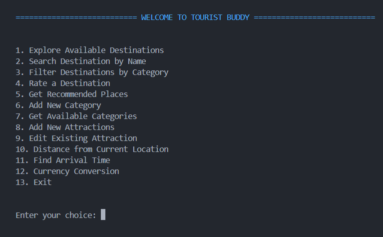

# TOURIST BUDDY



## Introduction

Tourist Buddy is a console-based application that offers travelers an immersive and informative experience, revolutionizing tourism activities worldwide. Users can easily explore destinations, landmarks, and cultural sites with user-friendly interfaces and real-time access to location-based information, enhancing their travel experiences. 

Notably, this project goes beyond tourism by creating opportunities for job creation and economic growth. By partnering with local businesses and tour operators, the application drives revenue to communities and fosters entrepreneurship in the travel industry. Additionally, the development and maintenance of the application provide avenues for software developers and content creators, contributing to innovation and skill development.

As the Virtual Tour Guide project evolves, it remains dedicated to empowering travelers and supporting local economies. Join us in our mission to explore the world, promote sustainable tourism, and create meaningful opportunities for job seekers and entrepreneurs.

## How To Run The App

1. Clone the repository to your local machine.

2. Open the terminal and navigate to the project directory.

3. Run the following command to install the required dependencies:

```bash
/bin/python3 /directory_of_the_project/main.py
```

4. The App will display to the Menu of the App:


5. Select the desired option to explore the features of the Virtual Tour Guide.
