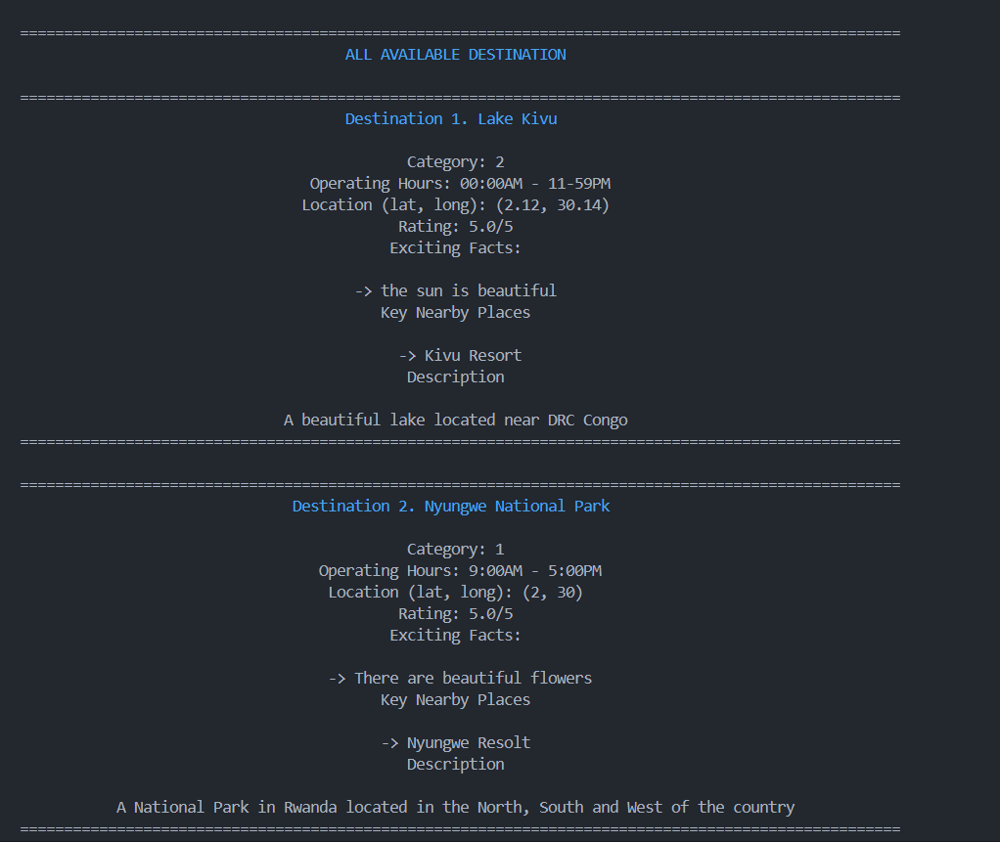

# TOURIST BUDDY


## Introduction

Tourist Buddy is a console-based application that offers travelers an immersive and informative experience, revolutionizing tourism activities worldwide. Users can easily explore destinations, landmarks, and cultural sites with user-friendly interfaces and real-time access to location-based information, enhancing their travel experiences. 

Notably, this project goes beyond tourism by creating opportunities for job creation and economic growth. By partnering with local businesses and tour operators, the application drives revenue to communities and fosters entrepreneurship in the travel industry. Additionally, the development and maintenance of the application provide avenues for software developers and content creators, contributing to innovation and skill development.

As the Virtual Tour Guide project evolves, it remains dedicated to empowering travelers and supporting local economies. Join us in our mission to explore the world, promote sustainable tourism, and create meaningful opportunities for job seekers and entrepreneurs.

## How To Run The App

1. Clone the repository to your local machine.

2. Open the terminal and navigate to the project directory.

3. Run the following command to install the required dependencies:

```bash
/bin/python3 /directory_of_the_project/main.py
```

4. The App will display to the Menu of the App:


5. Select the desired option to explore the features of the Virtual Tour Guide.

## Features

1. **Explore Available Destinations**: Users can discover popular destinations, historical sites, and cultural landmarks around the world.

In this feature, users will view the list of all available destinations that have been recorded in our application



2. **Search Destination Name**: It allows the user to search the destination by name, from the list of available destinations.


When the user does not get the destination, it tells them that it is not available. 

3. **Filter Destination By Category**: It filters all destinations by their categories.


when the category or the destination is not available, the user is told that it is unavailable.


4. **Rate a Destination**: Here the user get the option to rate the destination, from the experience he had. After rating they are told "Thank you for your feedback!"
 after rating
 when they use the wrong number to rate they are told to use the correct rating.

5. **Get Recommended Places**: This feature provides users with a list of recommended places based on their highly-rated places.


6. **Add New Category**: This feature allows users to add new categories for their favorite places that are not included in the existing categories.

7. **Get Available Categories**: This feature enables users to view the available categories of places to visit in our app.
